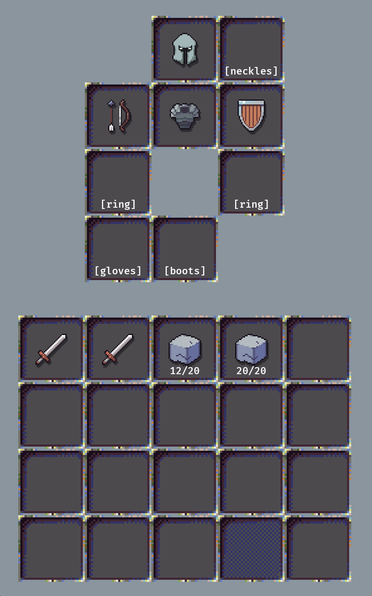

### WIP library for simple inventory management in bevy 0.17

##### Features:
- grid inventory displaying items
- drag and dropping items
- item tags, and slots with required item tags
- moving items between different inventories 
- double-click and shift-click items
- customizable rendering

##### TODO:
- loading, saving items
- preconfigured renderers
- project structure, turning it into workspace, with main library and examples
- examples

